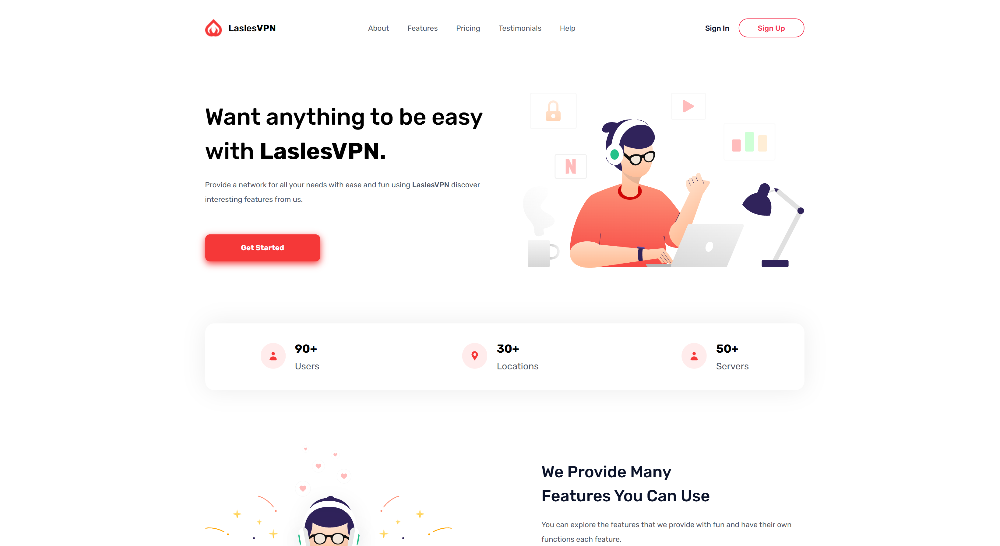
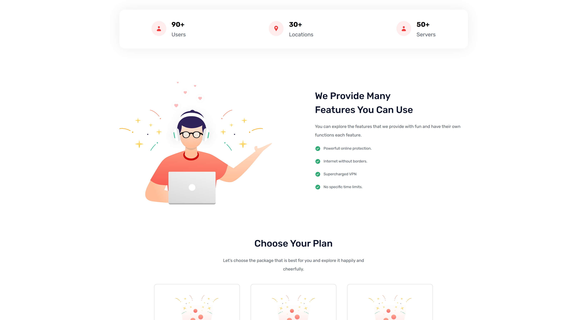
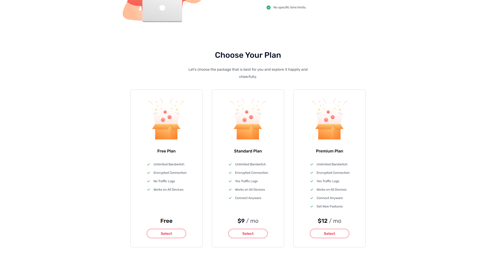
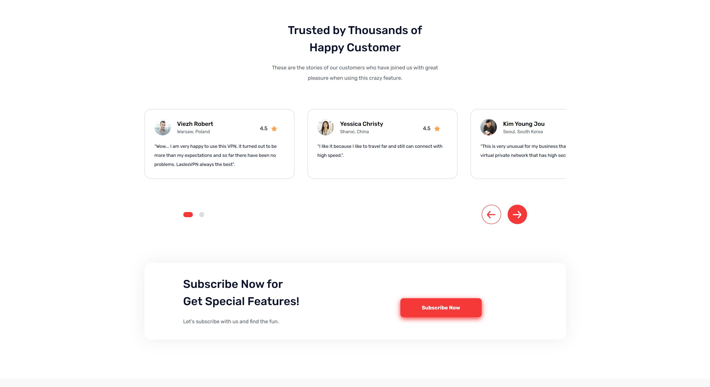

<div align="center">


# LaslesVPN

**A sleek, fully responsive landing page for a modern VPN service.**

Built with clean, hand-crafted HTML, SCSS, and CSS — no frameworks, no bloat.

[](#)
[](#)
[](#)
[](#)

### 🔗 [**Live Demo →**](https://lasles-vpn-proj.vercel.app/)

</div>

---

## ✨ Overview

**LaslesVPN** is a marketing/landing page concept for a fictional VPN product. It's designed to show off what a fast, private, borderless internet connection could look and feel like — with a bold hero section, feature highlights, pricing tiers, a global server map, and social proof from "customers."

The whole thing is built from scratch with semantic HTML and SCSS, focused on clean typography, smooth spacing, and a warm red-and-navy color palette.

## 📸 Preview

### Hero Section


### Features


### Pricing Plans


### Testimonials


## 🚀 Features

- 🎯 **Hero section** with a clear call-to-action and illustration
- 📊 **Stats bar** showcasing users, locations, and servers
- 🛡️ **Feature highlights** — online protection, borderless internet, no time limits
- 💳 **Three-tier pricing** — Free, Standard, and Premium plans
- 🌍 **Global network map** with recognizable partner brands
- ⭐ **Customer testimonial cards** with ratings and avatars
- 📱 **Fully responsive** layout with an animated burger menu for mobile
- 🎨 **Custom design system** driven entirely by CSS variables (colors, spacing, typography)

## 🛠️ Tech Stack

| Layer | Technology |
|---|---|
| Markup | HTML5 |
| Styling | SCSS → compiled CSS |
| Fonts | [Rubik](https://fonts.google.com/specimen/Rubik) via Google Fonts |
| Icons & Illustrations | Custom SVG assets |

No JavaScript frameworks, build tools, or dependencies required — it's pure front-end.

## 📂 Project Structure

```
LaslesVPN/
├── assets/              # Icons, illustrations, avatars, and brand logos
├── styles/
│   ├── style.scss       # Source styles
│   └── style.css        # Compiled stylesheet
├── design/
│   |── desktop/
│   └── mobile/       # README preview images
└── index.html            # Main page
```

## 🧑‍💻 Getting Started

Since this is a static site, you don't need a build step to view it — just clone and open it in a browser:

```bash
git clone https://github.com/OmarFarouk-Code/LaslesVPN.git
cd LaslesVPN
```

Then either:

- Open `index.html` directly in your browser, **or**
- Serve it locally for a smoother experience (recommended, so relative asset paths behave):

```bash
python3 -m http.server 8080
# then visit http://localhost:8080
```

If you'd like to edit the styles, modify `styles/style.scss` and recompile it with the Sass CLI:

```bash
sass styles/style.scss styles/style.css --watch
```

## 🎨 Design Tokens

Colors, spacing, and typography are all centralized as CSS custom properties at the top of `style.scss`, making it easy to re-theme the whole page by editing a handful of variables — no hunting through selectors.


## 🙋‍♂️ Author

**Omar Farouk**
[GitHub](https://github.com/OmarFarouk-Code)

---

<div align="center">
<sub>Built with ❤️ and a lot of CSS variables.</sub>
</div>
